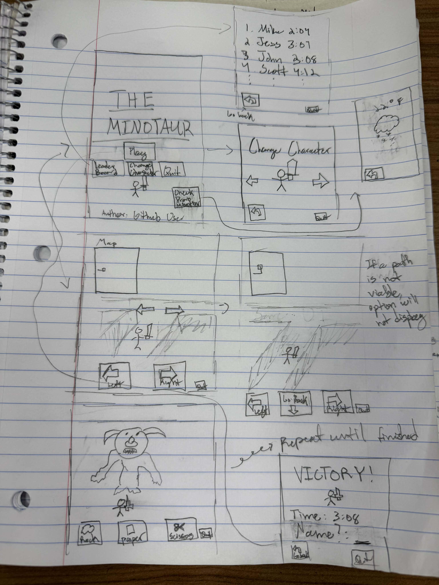
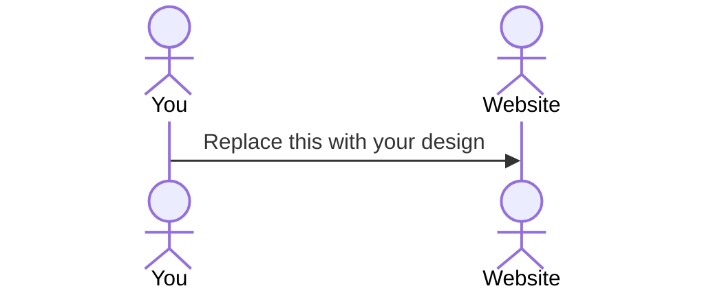

# The Minotaur  

[My Notes](notes.md)

*The Minotaur* is a game where players traverse a randomly generated maze in order to find and fight a Minotaur! Players can chose their hero of choice from a list of 6 characters. Players who beat the Minotaur and are able to beat previous times will have their time put on a leaderboard. Friends can compete against each other to see who can have the best score in beating and finding the monster!

## 🚀 Specification Deliverable

For this deliverable I did the following. I checked the box `[x]` and added a description for things I completed.

- [X] Proper use of Markdown
- [X] A concise and compelling elevator pitch
- [X] Description of key features
- [X] Description of how you will use each technology
- [X] One or more rough sketches of your application. Images must be embedded in this file using Markdown image references.

### Elevator pitch

We always here about the Greek gods and goddesses; but what about the monsters? Where's their fame and glory? Well now YOU can *find* and **slay** your own ancient Greek monster anywhere, anytime. With the new game *The Minotaur*, you can traverse a randomly generated maze to find and beat the Minotaur in a fierce enounter of rock🪨, paper📃, scissors✂️. Find him the quickest, and beat your friends as they try also find and beat this monster of gargantuan proportion. While doing so, you can also check the weather in the best college town known to man, Provo, UT!

### Design

Above is my idea for the possible screens within the game. We start off with the main play screen where we can view the leaderboard or change characters if desired. Don't forget being able to view Provo weather too! I then have an example of a game, and how to win. Each square is a new page or view that can be seen.

### Key features

- Ability to select different characters
- Time and username after each victory are saved permanently in the leaderboard.
- Map tracks the progress of the character
- Map can be retraversed if desired
- Randomized map every time with a new Minotaur location
- Can quite the application at any time in the UI
- Display the weather in Provo
  

### Technologies

I am going to use the required technologies in the following ways.

- **HTML** - I will mostly likely need 7 HTML pages: The beginning interface, the leaderboard, changing character page, display Provo weather page, play/maze traversing, fighting, and victory. While they are all somewhat similar, seperate pages I think will be appropiate to have a sense of difference in functionality. Hyperlinks will be used as needed to change pages when certain condition are met within the server, such as finding the Minotaur.
- **CSS** - I will use CSS to make all the respective pages fun, engaging, and staright forward. Certain styling will have to be done to insert the character and monster seamlessly into the page, as well as changing the color of certain buttons to hint at their functions. Font I intend to keep realitvely uniform throughout the game to keep with continuity.
- **React** - Provides the play/login, charater choice display, display weather button, chosing which path to follow during the maze, quitting, rock / paper / scissor selection, and inputting the name to be saved in the leaderboard.
- **Service** - Service endpoints will most likley contain the following:
    - Initiate play (This will login and register the user, assigning them randomly a number to then have be associated later with a name at the VICTORY screen to be saved in the Leaderboard part of the Database. character choice will also be registered with them for their instance of playing.)
    - Quit (Logout)
    - Randomize new map (Start alongside with play)
    - Change character
    - Retrieve the leaderboard
    - Move character right / left / go back
    - Fight the Minotaur with a user input
    - Retrieve weather info from Provo
- **DB/Login** - Stores users wins and registration on a database. Will also store user position on the map while game is being played, and character choice. Whenever users desire, they can retrieve and review that leaderboard from the initial page.
- **WebSocket** - Whenever a user beats the minotaur, their time and name will be broadcasted to other users once saved in the database.

## 🚀 AWS deliverable

For this deliverable I did the following. I checked the box `[x]` and added a description for things I completed.

- [ ] **Server deployed and accessible with custom domain name** - [My server link](https://yourdomainnamehere.click).

## 🚀 HTML deliverable

For this deliverable I did the following. I checked the box `[x]` and added a description for things I completed.

- [ ] **HTML pages** - I did not complete this part of the deliverable.
- [ ] **Proper HTML element usage** - I did not complete this part of the deliverable.
- [ ] **Links** - I did not complete this part of the deliverable.
- [ ] **Text** - I did not complete this part of the deliverable.
- [ ] **3rd party API placeholder** - I did not complete this part of the deliverable.
- [ ] **Images** - I did not complete this part of the deliverable.
- [ ] **Login placeholder** - I did not complete this part of the deliverable.
- [ ] **DB data placeholder** - I did not complete this part of the deliverable.
- [ ] **WebSocket placeholder** - I did not complete this part of the deliverable.

## 🚀 CSS deliverable

For this deliverable I did the following. I checked the box `[x]` and added a description for things I completed.

- [ ] **Header, footer, and main content body** - I did not complete this part of the deliverable.
- [ ] **Navigation elements** - I did not complete this part of the deliverable.
- [ ] **Responsive to window resizing** - I did not complete this part of the deliverable.
- [ ] **Application elements** - I did not complete this part of the deliverable.
- [ ] **Application text content** - I did not complete this part of the deliverable.
- [ ] **Application images** - I did not complete this part of the deliverable.

## 🚀 React part 1: Routing deliverable

For this deliverable I did the following. I checked the box `[x]` and added a description for things I completed.

- [ ] **Bundled using Vite** - I did not complete this part of the deliverable.
- [ ] **Components** - I did not complete this part of the deliverable.
- [ ] **Router** - I did not complete this part of the deliverable.

## 🚀 React part 2: Reactivity deliverable

For this deliverable I did the following. I checked the box `[x]` and added a description for things I completed.

- [ ] **All functionality implemented or mocked out** - I did not complete this part of the deliverable.
- [ ] **Hooks** - I did not complete this part of the deliverable.

## 🚀 Service deliverable

For this deliverable I did the following. I checked the box `[x]` and added a description for things I completed.

- [ ] **Node.js/Express HTTP service** - I did not complete this part of the deliverable.
- [ ] **Static middleware for frontend** - I did not complete this part of the deliverable.
- [ ] **Calls to third party endpoints** - I did not complete this part of the deliverable.
- [ ] **Backend service endpoints** - I did not complete this part of the deliverable.
- [ ] **Frontend calls service endpoints** - I did not complete this part of the deliverable.
- [ ] **Supports registration, login, logout, and restricted endpoint** - I did not complete this part of the deliverable.

## 🚀 DB deliverable

For this deliverable I did the following. I checked the box `[x]` and added a description for things I completed.

- [ ] **Stores data in MongoDB** - I did not complete this part of the deliverable.
- [ ] **Stores credentials in MongoDB** - I did not complete this part of the deliverable.

## 🚀 WebSocket deliverable

For this deliverable I did the following. I checked the box `[x]` and added a description for things I completed.

- [ ] **Backend listens for WebSocket connection** - I did not complete this part of the deliverable.
- [ ] **Frontend makes WebSocket connection** - I did not complete this part of the deliverable.
- [ ] **Data sent over WebSocket connection** - I did not complete this part of the deliverable.
- [ ] **WebSocket data displayed** - I did not complete this part of the deliverable.
- [ ] **Application is fully functional** - I did not complete this part of the deliverable.
